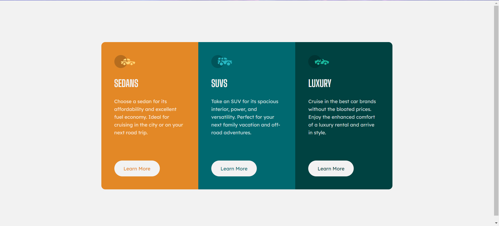

# Frontend Mentor - 3-column preview card component solution

This is a solution to the [3-column preview card component challenge on Frontend Mentor](https://www.frontendmentor.io/challenges/3column-preview-card-component-pH92eAR2-). Frontend Mentor challenges help you improve your coding skills by building realistic projects. 

## Table of contents

- [Overview](#overview)
  - [The challenge](#the-challenge)
  - [Screenshot](#screenshot)
  - [Links](#links)
- [My process](#my-process)
  - [Built with](#built-with)
  - [What I learned](#what-i-learned)
- [Author](#author)

**Note: Delete this note and update the table of contents based on what sections you keep.**

## Overview

### The challenge

Users should be able to:

- View the optimal layout depending on their device's screen size
- See hover states for interactive elements

### Screenshot



### Links

- Solution URL: [github solution](https://github.com/stormlycan/3-column-preview-card-component-main)
- Live URL: [github pages](https://stormlycan.github.io/3-column-preview-card-component-main/)

## My process

### Built with

- Semantic HTML5 markup
- CSS custom properties
- Flexbox
- CSS Grid

For styles

### What I learned

```html
<h1>Some HTML code I'm proud of</h1>
```
```css
body{
  display: flex;
  align-items: center;
}
```

```css
.wrapper {
  diplay: grid;
  grid-template-columns: 1fr 1fr 1fr;
}
```


## Author
- Frontend Mentor - [@stornlycan](https://www.frontendmentor.io/profile/stormlycan)